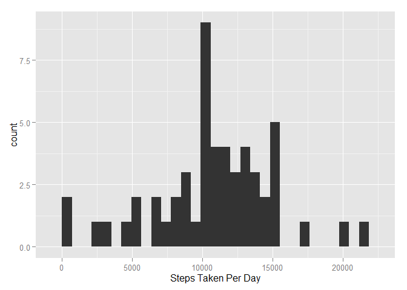
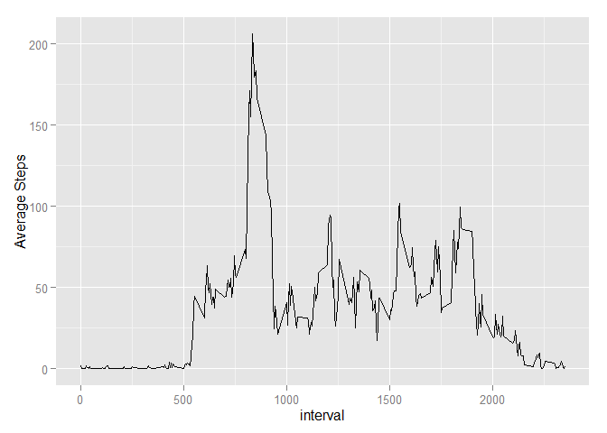
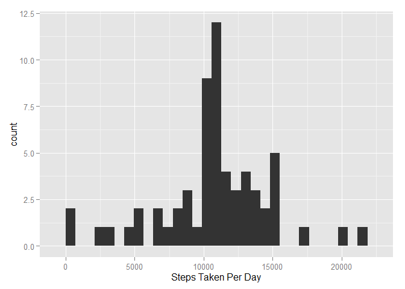
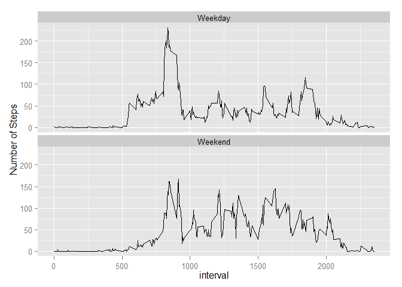

# Reproducible Research: Peer Assessment 1


## Loading and preprocessing the data

```r
activity<-read.csv("activity.csv")
activity_complete<-activity[complete.cases(activity),]
library(data.table)
activity_complete<-as.data.table(activity_complete)
```


## What is mean total number of steps taken per day?

```r
activity_daysum<-activity_complete[,sum(steps), by="date"]
library(ggplot2)
ggplot(activity_daysum, aes(x=V1))+geom_histogram()+xlab("Steps Taken Per Day")
```

```
## stat_bin: binwidth defaulted to range/30. Use 'binwidth = x' to adjust this.
```

 

##Values for the mean and median number of steps taken each day


```r
mean(activity_daysum$V1)
```

```
## [1] 10766.19
```

```r
median(activity_daysum$V1)
```

```
## [1] 10765
```

## What is the average daily activity pattern?

```r
activity_intavg<-activity_complete[, mean(steps), by="interval"]
ggplot(activity_intavg, aes(x=interval, y=V1))+geom_line()+ylab("Average Steps")
```

 

## Interval that on average gives the highest number of steps taken during the day


```r
activity_intavg[which(activity_intavg$V1==max(activity_intavg$V1)),]
```

```
##    interval       V1
## 1:      835 206.1698
```
## Imputing missing values


```r
sum(is.na(activity$steps))
```

```
## [1] 2304
```

###In the following code I replace NA values with the average value for that interval across all days
###I then generate a histogram for the number of steps taken each day using the imputed data


```r
steps<-activity$steps
steps<-as.numeric(steps)
activity_intavg<-as.data.frame(activity_intavg)
for (i in 1:length(steps)) {
     if(is.na(steps[i]))
     steps[i]<-activity_intavg[activity_intavg$interval==activity[i,3],2]
  }
activity$steps<-steps
```


```r
activity<-as.data.table(activity)
activity_impute<-activity[,sum(steps), by="date"]
library(ggplot2)
ggplot(activity_impute, aes(x=V1))+geom_histogram()+xlab("Steps Taken Per Day")
```

```
## stat_bin: binwidth defaulted to range/30. Use 'binwidth = x' to adjust this.
```

 

```r
mean(activity_impute$V1)
```

```
## [1] 10766.19
```


## Are there differences in activity patterns between weekdays and weekends?

```r
activity$date<-as.Date(activity$date)
activity$day<-weekdays(activity$date)
activity$weekend<-ifelse(activity$day=="Saturday"|activity$day=="Sunday","Weekend","Weekday")
activity_week<-activity[, mean(steps), by=c("interval", "weekend")]
ggplot(activity_week,aes(x=interval, y=V1)) + facet_wrap(~weekend, nrow=2) + geom_line()+ylab("Number of Steps")
```

 
